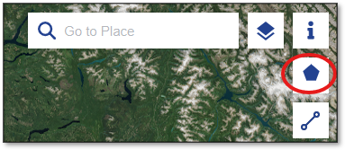
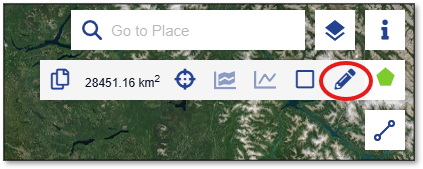
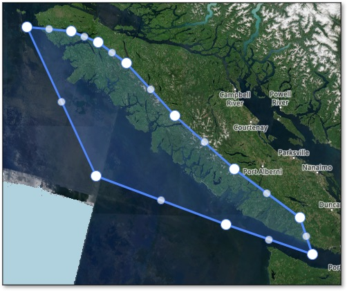
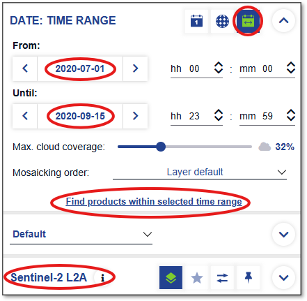
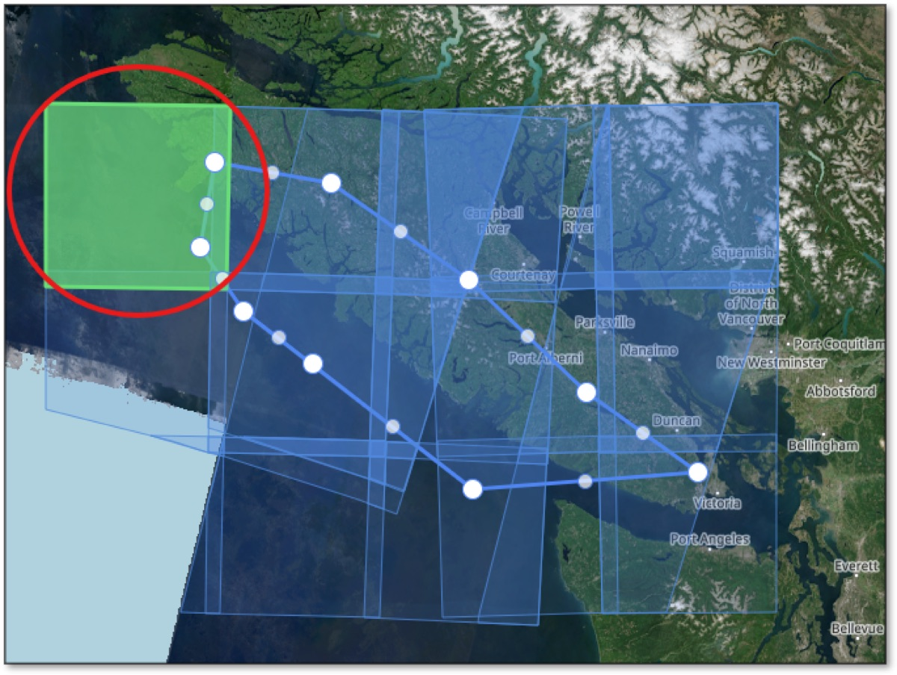
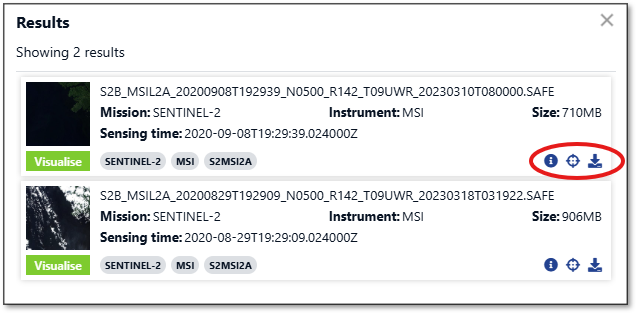

# Downloading Sentinel-2 Data

The SKeMa kelp models require **Sentinel-2 Level-2A (L2A)** satellite imagery in `.SAFE` folder
format. This guide walks through acquiring that data from the Copernicus Data Space Ecosystem,
which provides free access to the full Sentinel-2 archive.

## Step 1: Create a Copernicus Data Space Account

1. Navigate to [https://browser.dataspace.copernicus.eu/](https://browser.dataspace.copernicus.eu/)
2. Click **Register** and create a free account
3. Sign in to your account

## Step 2: Search for Imagery

1. Use the map view to navigate to your study area
2. Click **Create an area of interest** in the toolbar

    

3. Select **Draw polygon of interest** and draw a polygon around your study area

    

    

4. In the **Search** panel on the left:
    - Set the **Data Source** to **Sentinel-2** → **L2A**
    - Set your desired **date range**
    - Set **Max. cloud coverage** (e.g., 20%) to filter out heavily clouded scenes
5. Click **Search** to find available scenes

    

!!! tip "Choosing a scene"
    Select a scene with low cloud cover over your nearshore study area. Scenes with clouds
    over land but clear coastal water are usually fine.

## Step 3: Download

1. Click a scene tile in the map results to select it

    

2. Confirm the scene covers your area of interest with acceptable cloud cover
3. Click the download icon in the info panel — the file will be a `.zip` archive (typically 600 MB – 1 GB)

    

## Step 4: Extract the `.SAFE` Folder

Sentinel-2 downloads arrive as `.zip` files. You must extract them before passing them to
Habitat-Mapper.

=== "Mac / Linux"

    ```bash
    unzip S2A_MSIL2A_*.zip
    ```

=== "Windows (PowerShell)"

    ```powershell
    Expand-Archive -Path S2A_MSIL2A_*.zip -DestinationPath .
    ```

=== "Windows (File Explorer)"

    Right-click the `.zip` file and select **Extract All**, then choose a destination folder.

After extraction you will have a folder ending in `.SAFE`, for example:

```
S2A_MSIL2A_20230801T193851_N0509_R042_T10UED_20230802T003016.SAFE/
```

## Next Step

With your `.SAFE` folder ready, continue to [Selecting a Model Variant](model_variants.md)
to choose which SKeMa model to run and how to invoke it.
